# BT5151 Agentic Credit Risk Pipeline

An end-to-end agentic ML pipeline for multiclass credit risk classification (`Good` / `Standard` / `Poor`), built on LangGraph. Every analytical stage — from data cleaning to business explanation — is driven by a chain of LLM calls with programmatic validation, self-repair loops, and a three-tier hypothesis system (tested → supported → exploratory) that chains observations across EDA, training, and XAI.

Dataset: `train.csv` (100k rows, 28 columns, Kaggle credit score dataset).
Design intent: the pipeline core is dataset-agnostic; swapping the dataset requires only a new CSV and updated `.env` config.

---

## Architecture

```mermaid
flowchart TD
    subgraph SPEC["Spec Layer"]
        A([Raw CSV]) --> DPS[dataset-policy-spec\nLLM: target · split · leakage policy]
        DPS --> EDA[exploratory-data-analysis\nMI · ANOVA · correlations · skew]
        EDA --> EH[generate-eda-hypotheses\nLLM o4-mini: 3-tier directional predictions]
        EH --> CTS[column-transform-spec\nLLM o3: per-column roles · encoding · imputation]
    end

    subgraph PREP["Preprocessing Loop  ↺ up to 5 attempts"]
        CTS --> GPC[generate-preprocessing-code\nLLM: codegen from spec]
        GPC --> IPC[inspect-preprocessing-code\nstatic analysis · blocklist]
        IPC --> EXP[execute-generated-preprocessing\nsubprocess · 180s timeout]
        EXP --> VAL[validate-preprocessing-output\ndeterministic schema checks]
        VAL --> AUD[review-preprocessing-quality\nLLM: audit feature frame]
        AUD -->|needs_repair| RPC[repair-preprocessing-code\nLLM: fix from audit feedback]
        RPC --> IPC
        AUD -->|pass| FE_START
    end

    subgraph FE["Feature Engineering Loop  ↺ up to 3 attempts"]
        FE_START([FE start]) --> GFE[generate-feature-engineering-code\nLLM o4-mini: dual-view codegen]
        GFE --> IFE[inspect-feature-engineering-code\nstatic analysis]
        IFE --> EFE[execute-feature-engineering\nsubprocess]
        EFE --> VFE[validate-feature-engineering\nnumeric contract · view alignment]
        VFE -->|fail| RFE[repair-feature-engineering-code\nLLM: fix from validation error]
        RFE --> IFE
        VFE -->|pass| TM
    end

    subgraph TRAIN["Training Layer"]
        TM[train-models\nLR · RF · XGB · Optuna · grouped CV]
        TM --> EM[evaluate-models\nper-class metrics · confusion · confidence]
        EM --> TD[training-diagnostics\nLLM o4-mini: capacity · confusion flow · hypothesis validation]
        TD --> SM[select-model\nLLM: justification]
    end

    subgraph XAI["XAI Layer"]
        SM --> GX[global-xai\nSHAP · grouped PFI · PDP · ALE]
        GX --> LX[local-xai\ncasebook: representative · borderline · worst misclass per class]
        LX --> IGX[interpret-global-xai\nLLM o4-mini: cross-method consensus · feature effects]
        IGX --> ILX[interpret-local-xai\nLLM o4-mini: per-class stories · boundary analysis]
        ILX --> PAB[package-analysis-bundle\nfull semantic bundle → lab/logs/]
    end

    subgraph INFER["Inference + Explanation"]
        PAB --> RI[run-inference\npredict · per-prediction SHAP]
        RI --> ER[explain-risk\nLLM: evidence-traced business explanation]
        ER --> RA[recommend-action\nLLM: next action]
        RA --> OUT([Output])
    end
```



**Dual-view FE:** The FE stage produces two model-specific feature frames — `linear_view` (one-hot encoded, log-transformed, standardized) and `tree_view` (frequency/ordinal encoded, raw scale) — so each model family gets the representation it performs best with.

**Hypothesis chain:** EDA hypotheses (three-tier) → validated by training diagnostics → cross-checked by global XAI interpretation → grounded in per-case local XAI stories → synthesized by explain-risk into customer-facing output. Every claim carries a `tier` (tested / supported / exploratory) and `layer` (eda / training / global_xai / local_xai) tag.

---

## Models

| Model | Tuning | View |
|---|---|---|
| Logistic Regression | Optuna C search (log scale) | `linear_view` |
| Random Forest | Optuna depth + min_samples_split | `tree_view` |
| XGBoost | Early stopping on 20% holdout, retrain full train on best round | `tree_view` |

Validation: `GroupShuffleSplit` by `Customer_ID` (entity-level, no leakage across splits).

---

## XAI Methods

| Method | When | Purpose |
|---|---|---|
| SHAP (global + per-case) | Always | Feature attribution, beeswarm, dependence plots |
| Grouped PFI | Always | Correct PFI for one-hot features — permutes entire original feature as a group |
| PDP (per-class curves) | Top uncorrelated continuous features | How feature shifts probability mass between classes |
| ALE (per-class curves) | Top correlated continuous features | Bias-corrected version of PDP when features are correlated |

Local casebook per class: **representative** (most confident correct), **borderline** (least confident correct), **worst misclassification** (most confident wrong + which class it confused with). Up to 9 cases total.

---

## Run

```bash
python3 -m venv .venv
source .venv/bin/activate
pip install -r requirements.txt
cp .env.example .env   # add your OPENAI_API_KEY
```

```bash
# Full pipeline (row 42 for inference demo)
PYTHONPATH=src python run_stage.py full 42

# Stop early at specific stages
PYTHONPATH=src python run_stage.py specs        # EDA + column-transform-spec
PYTHONPATH=src python run_stage.py preprocess   # + preprocessing loop + FE loop
PYTHONPATH=src python run_stage.py evaluate     # + training + model selection
```

```bash
# Tests
PYTHONPATH=src pytest tests/ -q   # 89 passing
```

---

## Per-node Model Config

Each LLM node can be overridden independently in `.env`:

```env
OPENAI_MODEL=gpt-4o                              # global default
OPENAI_MODEL_COLUMN_TRANSFORM_SPEC=o3            # spec node — most consequential, uses o3
OPENAI_REASONING_EFFORT_COLUMN_TRANSFORM_SPEC=high
OPENAI_MODEL_GENERATE_FEATURE_ENGINEERING_CODE=o4-mini
OPENAI_MODEL_GENERATE_EDA_HYPOTHESES=o4-mini
OPENAI_MODEL_GENERATE_TRAINING_DIAGNOSTICS=o4-mini
OPENAI_MODEL_INTERPRET_GLOBAL_XAI=o4-mini
OPENAI_MODEL_INTERPRET_LOCAL_XAI=o4-mini
OPENAI_MODEL_EXPLAIN_RISK=gpt-4o
```

---

## Repository Layout

```
src/bt5151_credit_risk/   # pipeline modules
  graph.py                # LangGraph graph definition + all node functions
  preprocess.py           # preprocessing codegen, validation, repair
  feature_engineering.py  # FE codegen, validation, repair
  train.py                # model definitions, Optuna tuning, grouped CV
  evaluate.py             # per-class metrics, confusion matrix, confidence stats
  xai.py                  # SHAP, grouped PFI, PDP, ALE, casebook selection
  hypotheses.py           # LLM calls: EDA hypotheses, training diagnostics, XAI interpretation
  business.py             # LLM calls: explain-risk, recommend-action
  state.py                # CreditRiskState (Pydantic)
  llm.py                  # OpenAI client, per-caller model override, JSON retry
  config.py               # dataset config (target column, group column)

skills/                   # one skill prompt per LLM node
tests/                    # 89 tests covering all modules and graph wiring

lab/
  experiments/            # one record per pipeline run (goals, results, findings)
  logs/                   # run logs (stage_full_YYYYMMDD_HHMMSS.log) + analysis bundles
  analysis/               # architectural decision notes and design trade-offs
  backlog.md              # deferred ideas with rationale

run_stage.py              # CLI entry point — run pipeline to any stage
```

---

## Current Best Result

Run 009 (before XAI overhaul): **XGBoost macro_f1 = 0.8017** on grouped entity split.

Active work is on the XAI overhaul (runs 010–012): split interpret nodes, verbatim analysis bundle, dual-view encoding contracts, deferred categorical handling. Next run expected to recover Run 009 performance with full XAI chain operational.
