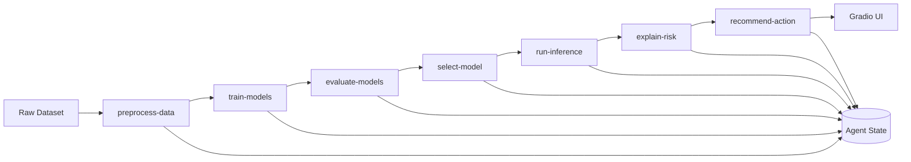

# BT5151 Agentic ML Pipeline

## Goal

Build a real agentic ML pipeline that:

- preprocesses a labelled dataset
- trains and compares at least two models
- selects one model with justification
- runs inference through LangGraph
- turns model output into a business-facing result in Gradio

Current anchor dataset:

- `train.csv`
- use case: credit risk classification (`Good` / `Standard` / `Poor`)

Important design choice:

- this dataset is the current testbed, not the only intended dataset
- the pipeline should become reusable for other labelled tabular datasets with minimal changes to dataset config, preprocessing rules, model configs, and prompts

## What Has Been Built

- Python package scaffold under `src/bt5151_credit_risk/`
- real LangGraph pipeline with distinct nodes
- candidate models:
  - `logistic_regression`
  - `random_forest`
- evaluation helpers for multi-class classification
- OpenAI-backed downstream nodes for explanation and action generation
- notebook wired to the compiled graph
- `skills/` folder with one stage file per node
- local `.env` setup using `python-dotenv`
- test suite covering imports, state, preprocessing, training, evaluation, graph, and notebook wiring

Current verification:

```bash
source .venv/bin/activate
PYTHONPATH=src pytest -v
```

Current status:

- `14` tests passing

## Architecture



## Current Node Responsibilities

### `preprocess-data`

- load dataset
- build dataset profile
- drop direct identifiers
- produce grouped train/test split
- prepare feature frame for downstream nodes

### `train-models`

- build candidate models
- fit both models on the training split

### `evaluate-models`

- score both models on held-out data
- compute required metrics

### `select-model`

- choose a winner from evaluation results
- store justification in state

### `run-inference`

- run the selected model on a chosen input row
- return label, probabilities, confidence, and source record

### `explain-risk`

- call the OpenAI API
- convert prediction output into business-readable risk explanation

### `recommend-action`

- call the OpenAI API
- convert the explanation into a recommended next action

## What Still Needs To Be Optimized

This is the important part for the team.

### `preprocess-data`

- make cleaning more dataset-aware, not just placeholder replacement
- parse messy numeric and categorical fields properly
- persist preprocessing artifacts so inference uses the exact same transform path as training
- support configurable schema instead of assuming only the current dataset columns
- keep leakage control strict, especially for repeated entities like `Customer_ID`

### `train-models`

- make model configs easier to swap for other datasets
- add optional hyperparameter tuning
- support task-specific model registry instead of a fixed two-model list forever

### `evaluate-models`

- add required visualisations in the notebook
- support metric sets by task type, not only current multi-class classification
- add slice-based evaluation and error analysis

### `select-model`

- improve justification logic beyond simple metric comparison
- include business trade-offs such as cost of false reassurance
- make selection logic reusable across datasets and task types

### `run-inference`

- move from row-index demo input to real user input mapping
- support both single-record and batch inference
- ensure schema validation before inference

### `explain-risk`

- tune prompts for stable structured output
- reduce hallucination and vague language
- make explanations grounded in model output and available record fields
- test latency and token cost

### `recommend-action`

- define a stable action taxonomy
- make action recommendations consistent across similar risk cases
- test whether action outputs are actually useful for business users

### `Gradio UI`

- replace the row-index-only interaction with a real business-facing input form
- surface confidence clearly without exposing too much technical clutter
- make outputs easy to scan during demo and presentation

## Generalization Direction

We should not build this as a one-dataset-only system.

Target direction:

- keep the pipeline core generic
- plug in dataset-specific config at the edges

What should be generic:

- graph structure
- state contract
- model training interface
- evaluation interface
- downstream prompting interface

What can stay dataset-specific:

- target column
- group or entity column
- cleaning rules
- feature engineering rules
- task type
- prompt framing for the business domain

Practical goal:

- the current credit-risk dataset helps us develop and test the pipeline
- later, another labelled dataset should work by swapping config and stage logic, not by rebuilding the whole repo

## Immediate Roadmap

1. Harden `preprocess-data` on the real dataset.
2. Produce final evaluation metrics and visualisations.
3. Improve node prompts through fast trial and error with the API.
4. Replace the row-index notebook demo with a more realistic input path.
5. Run and document at least three full end-to-end test cases.
6. Capture actual failure modes and improve the weak nodes.
7. Finalize report, slides, and demo assets.

## Run

Setup:

```bash
python3 -m venv .venv
source .venv/bin/activate
pip install -r requirements.txt
```

Environment:

```env
OPENAI_API_KEY=your_real_key_here
OPENAI_MODEL=gpt-4o-mini
```

Test:

```bash
source .venv/bin/activate
PYTHONPATH=src pytest -v
```

Notebook:

```bash
source .venv/bin/activate
jupyter notebook bt5151_credit_risk_pipeline.ipynb
```
